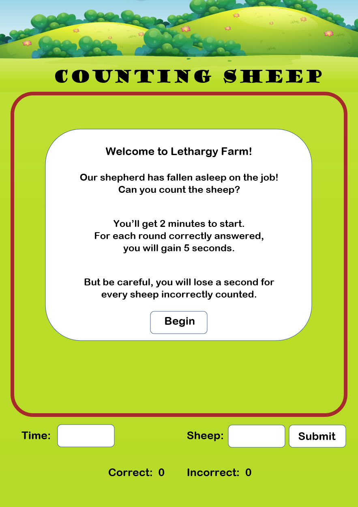
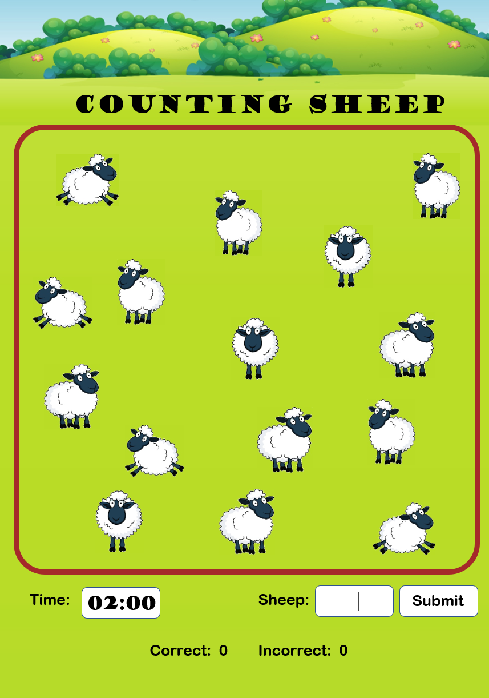
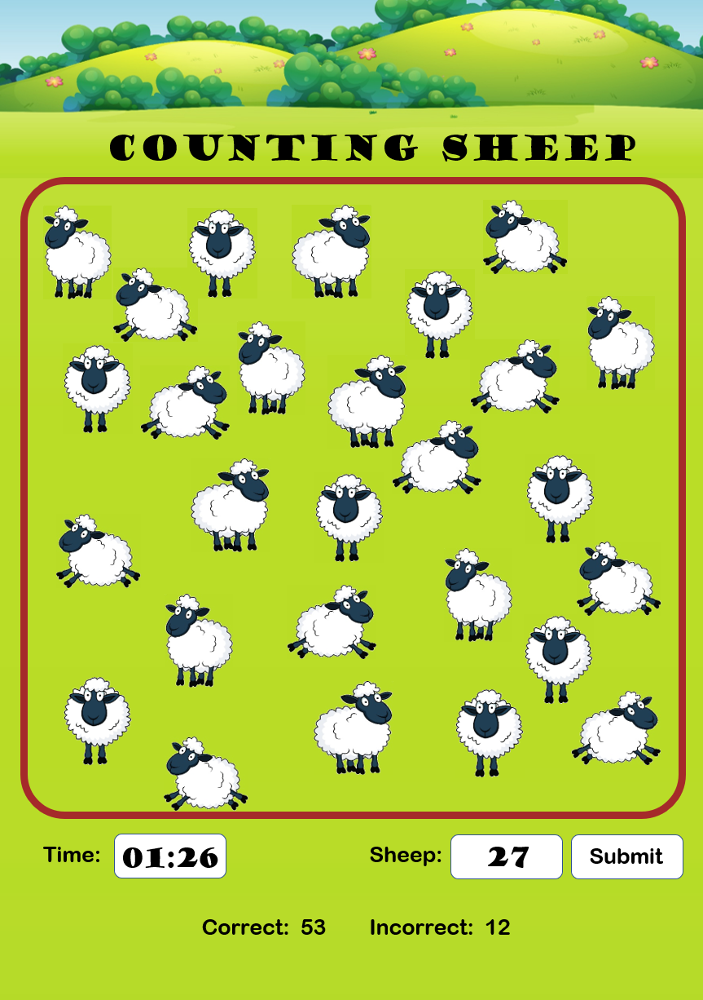
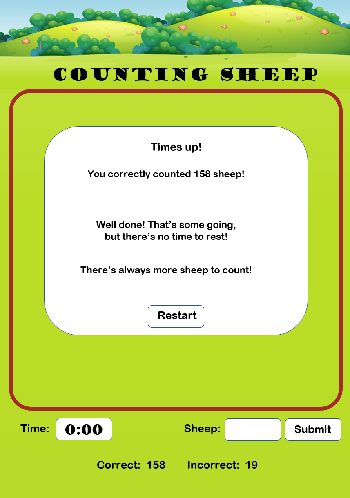
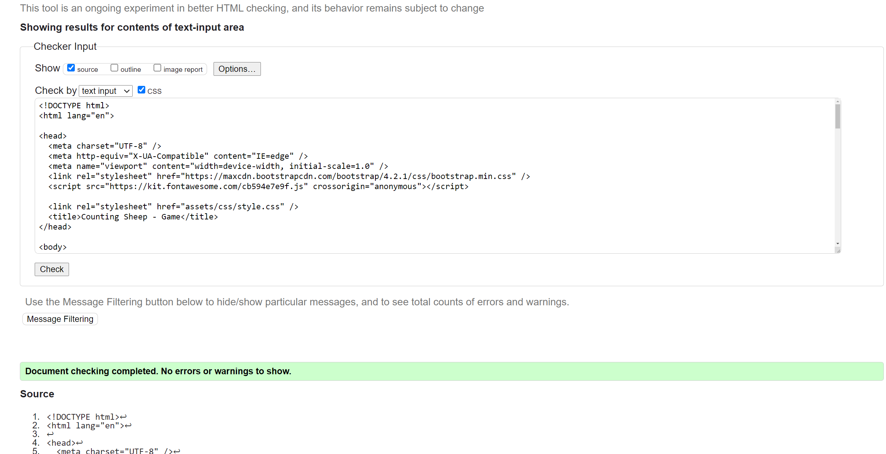
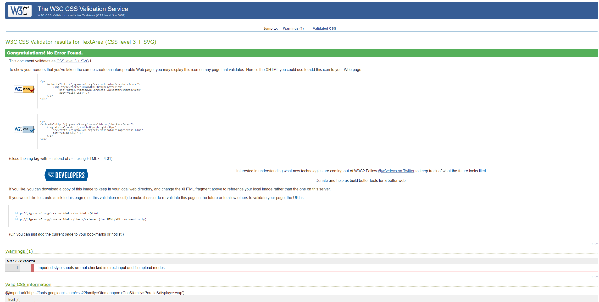
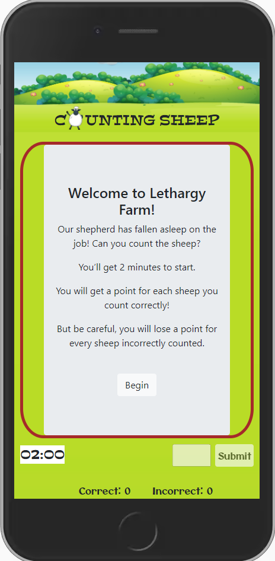
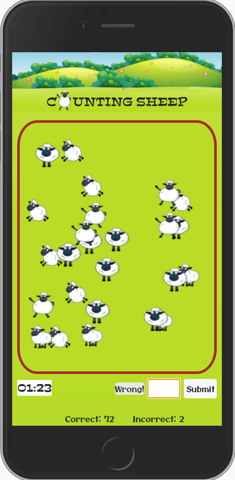
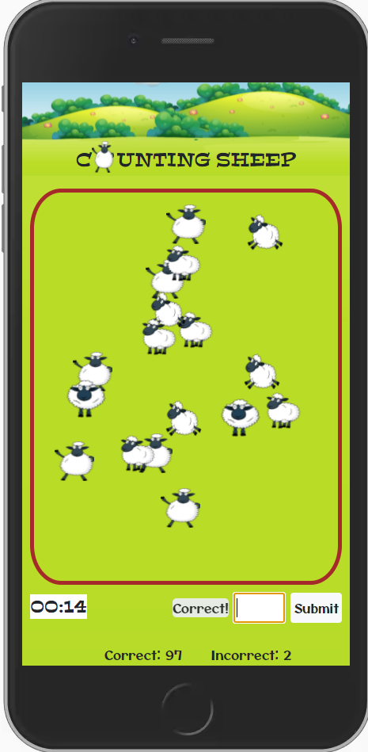
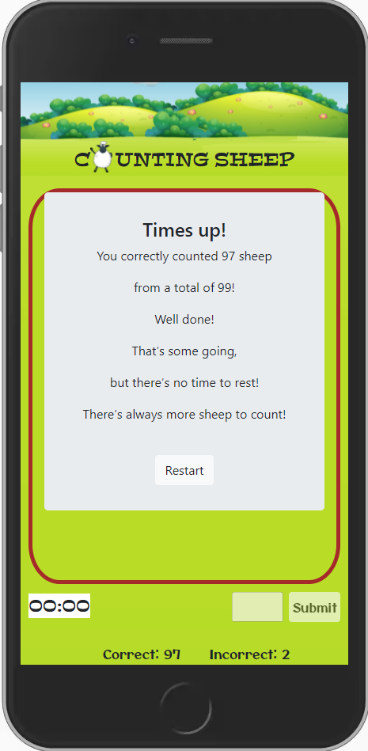

# Counting Sheep - Game

I will plan, code and implement a game:

- When the game is started a random number of sheep will appear on the screen and a countdown timer will begin.

- The user either guesses or counts the number of sheep in each round (the number of sheep changes after every guess).

- If the user is correct, the number of sheep is added to the "Correct" score tally.

- If the user is incorrect, the number of sheep the user is off by is added to the "Incorrect" score tally. The correct score is incremented by the amount of sheep there were in total minus the amount the user is off by (i.e. if the user guesses 4 more than were there in total, 4 are taken of the total). This method discourages high guesses to cheat the game.

- When the timer reaches zero, the game is over and the users final score is given by the number of sheep correctly counted.

## UX

The website will have a target audience of both younger and older users.

- Users of all ages may use the game to pass the time or to counteract boredom.

- Younger users may use the game to practice and improve counting and observation skills, in a fun, enjoyable and non-intimidating environment.

- Older users will enjoy the challenging aspect of the game with an aim to get 100% score.

#### User Stories

- "I often play simple and straight forward games if I am bored or I have some spare time."

- "My child has recently learned to count and would make use of a fun, colourful, child-friendly game to practice."

- "I enjoy challenging games especially when I am competing with myself and my previous scores; knowing I am improving with practice."

---

#### Mockups

The game-page was first developed using a hand-drawn wireframe to assertain how the layout and structure will be assembled.

Following this, mockups of the game were constructed at various stages of the game-process:

Landing/Welcome Page


Game Start


Mid Game


Game End



---

## Features

### Existing Features

Layout
- The background features hills in the far distance, with a field in the foreground which acts as the game area.
- The game area is surrounded by a a brown box which acts as a 'fence'.
- Below the game area is the score area - a timer on the left, with an answer-input/submit button on the right and finally a score section below with both correct and incorrect indicators.

The Landing/Welcome Screen:
- The Timer is frozen on the time limit (two minutes).
- The answer-input/submit button is disabled.
- The correct and incorrect scores both show zero. 
- A welcome message appears in the game area.
- The welcome message gives a light hearted, comical context to the user and explains the rules of the game, with a button to start the game.

Game Start:
- The welcome message dissapears upon pressing the start button.
- A random number of sheep, in random positions, will appear in the brown box.
- The timer begins to countdown from 2 minutes.
- The answer-input and submit button are activated.
- The answer-input will have focus.

Mid Game:
- Users must count the sheep, then type how many there are in the answer-input and click submit or hit enter.
- The game determines if the answer was correct or incorrect and a relevant message appears briefly; either "Correct!" or "Wrong!".
- If correct, the number of sheep counted is incremented on to the "Correct" score value.
- If incorrect the amount the user was out by is added to the "Incorrect" score value and the "Correct" score is increased by the offset value (i.e. the correct number of sheep minus the number of sheep the user was off by).
- After submit is pressed and all scores are calculated, the game area and answer-input is cleared and a new random number of sheep in random positions appear.
- The game repeats round after round until the timer reaches zero. 

Game End:
- When the timer reaches zero the game ends.
- The correct and incorrect scores are frozen at the final score obtained.
- The answer-input and submit button is disabled. 
- The game area and answer-input fields are cleared.
- An "Time's up!" message appears to tell the user the total number of sheep counted from a possible maximum, with more text to encourage the user to restart the game.
- The "Time's up!" message includes a button to restart the game.

Restart game:
- The game area is cleared (the "Time's up!" message dissapears).
- The timer restarts from two minutes.
- The answer-input and submit button are reactivated.
- The correct and incorrect score values are zeroed.
- A new random number of sheep appear and so begins a new game.

### Yet to be Implemented

Update Timer During Game Play
- Addition/subtraction of a defined number of seconds on the timer with correct/incorrect answers.
- This was originally the concept of the game as can be seen in the mockups. It was found to be difficult to implement but is believed to be possible with more time and futher investigation.

Change Timer Duration
- An option to change the timer's duration pre-game.

Prevent Hidden Sheep
- As the sheep are rendered with a position of absolute (to ensure random spread within the game area), some images are sometimes covered by others. Although complete coverage is rare, it will be investigated on how to prevent this occurring.

Game Modes
- Different game modes for different age groups or ability level - Easy, Medium and Hard game modes with an increasing number of sheep.

Best Score List
- A method of keeping track of the best scores.

Share to social media:
- A method of sharing either the user's score, or the game to social media.

Sign-up:
- User's could sign-up for exclusive content and game play benefits.

---

## Technologies Used
- [Microsoft Word](https://www.microsoft.com/en-gb/microsoft-365/word) was used to construct the mockups as the ability to add text, shapes, pictures, colour and effects is useful in getting a detailed idea of layout.
- [Gitpod](https://gitpod.io/) is used as an online IDE as a platform on which to code.
- [Favicon.io](https://favicon.io/favicon-converter/) was used to create the favicon from a png.
- [VS Code](https://code.visualstudio.com/) is used by Gitpod as it's IDE.
- [Boostrap 4.5](https://getbootstrap.com/docs/4.5/getting-started/introduction/) was used for frameworks and general code templates.
- HTML5 is a markup language and has been used to structure and present the content of the webpage.
- CSS3 (Cascading Style Sheets) is a style sheet language used for describing the presentation of a document written in HTML
- [JavaScript](https://www.javascript.com/) is a high-level programming language and has been used to add interactivity.
- [jQuery Core 3.6.0](https://code.jquery.com/) was used to provide added efficiency to the JavaScript.
- [DLPNG](https://dlpng.com) was used to get a png.
- [subpng](https://www.subpng.com/) was also used to get some png images.
- [W3C Markup Validation Service](https://validator.w3.org/) was used to test and check the HTML for errors.
- [W3C CSS Validation Service](https://jigsaw.w3.org/css-validator/) was used to test and check the CSS for errors.
- [JSHint](https://jshint.com/) was used to check the JavaScript for errors.


---

## Testing

1. W3C testing HTML.
The game was checked by copying and then pasting its html code into the validator. The result often returned  3 errors: 

- Two images were missing the alt attribute. The first as the background hills image and the second was the sheep logo image in the page header. This was resolved by adding alt attributes to the images.
- Finally a href link was included in the button, and must be associated with an anchor element. The href link was to align the user's screen to the game area but had a bug making it offset and cut some of the game area off. This link was removed and the user must now manually align the screen. This will be further investigated as some users may need to be shown the answer-input.

- A screenshot of the validator was taken after testing the code and resolving the issues:

index.html



2. CSS testing
- W3C CSS (Jigsaw) Validator was used to test for errors. The test returned no errors:

style.css


3. JavaScript Testing
- JSHint was used to test the JavaScript code. No major errors were found, but revealed some syntax errors and unused variables which were corrected or deleted. 26 further warnings were returned, however these are all necessary JavaScript.

4. Lighthouse (Dev Tools)
A report was conducted for a mobile device, and returned the following scores:
- Performance - 78%
- Accessibility - 82%
- Best Practices - 87%
- SEO - 92%

There are many things that could be optimised, the main one being adding appropriately sized images, which would significantly improve the load time. This and all suggestions will be considered for future improvements.

5. User Stories
- The first user story is addressed as the game is simple, although it could be less complicated from a user's viewpoint regarding the scoring system. As seen in the image of the landing page below:

- The second user story is addressed as the game is colourful, fun and child friendly, while it would assist with counting and observational skills. This is shown in the following screenshots taken mid game:


- The final user story is fulfilled the game can be challenging as the user will be trying to beat their own scores and therefore always trying to improve. This is shown in the screenshot of the end game message below:


## Individual Page Testing 

Welcome/Landing Screen:
- Ensure the layout, welcome message and images render correctly.
- Ensure the timer is frozen to "02:00".
- Ensure the answer-input and submit button is disabled.
- Ensure the correct and incorrect scores are set to zero.
- Resize the screen to ensure page heading resizes accordingly.
- Resize the screen to ensure the "Time" and "Sheep" labels are hidden on smaller devices while the layout remains clear and intuitive.
- Ensure the start("Begin") button takes the user in to the start game process.

Start game:
- Ensure the timer starts the countdown.
- Ensure the answer-input and submit button is activated.
- Ensure the welcome message dissappears.
- Ensure a random number of sheep are rendered at random positions within the game-area.
- Resize the screen to ensure that the sheep images are rendered clearly at all sizes.

Mid game:
- Ensure the timer is working properly.
- Ensure a answer-input and submit button work properly.
- Ensure a correct or incorrect answer is confirmed accordingly.
- Ensure a correct answer increments the correct score value.
- Ensure an incorrect answer increments the incorrect score value, and the offset value is incremented on the correct score value.
- Ensure the appropriate "Correct!" or "Wrong!" message appears according to the user's answer and that it fades out after 3 seconds.
- Click the submit button to check that the game area is cleared and a new random number of sheep images are rendered in new randomised positions.

End Game:
- Ensure the timer stops at "00:00".
- Ensure the answer-input and submit button is disabled.
- Ensure game area is cleared and the end game message appears.
- Ensure the end game message gives the user their final score, from a possible maximum score, which matches the calculated scores at the bottom.
- Check the restart button begins the game again.

Restart:
- Ensure the timer starts the countdown from "02:00".
- Ensure the answer-input and submit button is activated.
- Ensure the end game message dissappears.
- Ensure a random number of sheep are rendered at random positions within the game-area.
- The Mid game testing process can then be conducted again to ensure smooth operation.

All testing procedures stated were then also carried out on the deployed version of the game. The deployed version can be found using the method in the Deployment section.
---

## Bugs

- The sheep are often rendered behind/in-front of each other. On smaller screens this can be an issue.
- The href atribute initially put on the start button to align the users screen with the game-area would not align to the section proposed but to the bottom of the screen. Even though an error was revealed as the href must be on an anchor element, this could have been altered, however the href attribute was removed due to the screen viewpoint moving to the bottom, cutting off some of the game area on smaller devices.
- The jumbotrons are not as small as I'd like and an attempt to resize them will be made.

## Deployment

This project was developed on [Gitpod](https://gitpod.io/) using the [VS Code](https://code.visualstudio.com/) IDE. It was committed to git and pushed to [Github](https://github.com/) using the built-in Gitpod function.

To deploy the website to [Github Pages](https://pages.github.com/) the following steps were taken.

1. Log in to Github.
2. From the list of repositories, select **lukdav/RUD-band**.
3. Select **Settings** from the right hand side of the menu near the top.
4. Scroll down to the **Github Pages** section.
5. Under **Source**, click the drop-down menu labelled **None** and select **Master Branch**.
6. Click **Save** and the page automatically refreshes.
7. Scroll back down to the **Github Pages** section to retrieve the link to the deployed site.

Note: the deployment of a website is not instant and can take up to 20 minutes.

At the moment of submitting the User Centric Milestone Project, both the Developement Branch and the Master Branch are identical.

### How to run this project locally

To clone this project from GitHub:

1. Follow this link to the [Project GitHub Repository].
2. Next to the green Gitpod button, open the drop-down marked **Code**.
3. In the Clone with HTTPS section, copy the URL for this repository.
4. In your local IDE open Git Bash.
5. Change the current working directory to the location where you want the cloned directory to be made.
6. Type `git clone` and then paste the URL you copied in step 3.

    ```git clone https://github.com/lukdav/RUD-Band.git```

7. Press Enter. Your local clone will be created.

Further reading and troubleshooting on cloning a repository can be found [here](https://docs.github.com/en/github/creating-cloning-and-archiving-repositories/cloning-a-repository).


---

## Credits

The code for the timer was found on the [Stackoverflow](https://stackoverflow.com/questions/20618355/how-to-write-a-countdown-timer-in-javascript) website at the link and was edited for specific use on this site. The original code is as follows:

``` 
function startTimer(duration, display) {
    var timer = duration, minutes, seconds;
    setInterval(function () {
        minutes = parseInt(timer / 60, 10);
        seconds = parseInt(timer % 60, 10);

        minutes = minutes < 10 ? "0" + minutes : minutes;
        seconds = seconds < 10 ? "0" + seconds : seconds;

        display.textContent = minutes + ":" + seconds;

        if (--timer < 0) {
            timer = duration;
        }
    }, 1000);
}

window.onload = function () {
    var fiveMinutes = 60 * 5,
        display = document.querySelector('#time');
    startTimer(fiveMinutes, display);
}; 
```

```
<body>
    <div>Registration closes in <span id="time">05:00</span> minutes!</div>
</body>
```


#### Media
The photos used in this site were obtained using a Google 'free image search' (under a creative commons licence) and can be found at the following links:
- [sheep1](https://www.subpng.com/png-pk930m/download.html)
- [sheep2](https://dlpng.com/png/6991256)
- [sheep3](https://www.subpng.com/png-nt7mbf/download.html)
- [sheep4](https://www.subpng.com/png-20ccij/)

- [background](https://www.vecteezy.com/vector-art/413580-a-beautiful-green-landscape)

The landscape background was free but required attribution and so a link was placed at the bottom of the screen.

---

## Acknowledgements
I received inspiration for this project from a number of free games available as apps.
